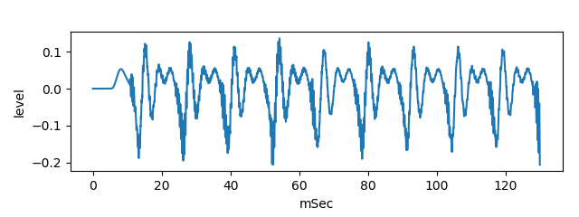

# vocal tract tube model with noise mix  
 
This is an experiment to generate vowel /i/ sound by two tubes model and noise source.  

[github repository](https://github.com/shun60s/Vocal-Tube-I-Model)  

## usage  

Generate noise sound, using perlin noise    
```
python3 PerlinNoise.py  
```


Generate pseudo vowel /i/ sound, without noise mix and with noise    
```
python3 main2.py  
```

It will save yout_i_long.wav (without noise mix)  
  
and save yout_i_noise-mix_long.wav (with noise mix).  
  

## Document  

For more information, please see [related WEB](https://wsignal.sakura.ne.jp/onsei2007/scilab456e.html#chapter3) or 
[same content in Japanese](https://wsignal.sakura.ne.jp/onsei2007/scilab6.html)  


## License  
MIT  
Regarding to PerlinNoise.py, please follow the notice in the source code.  
